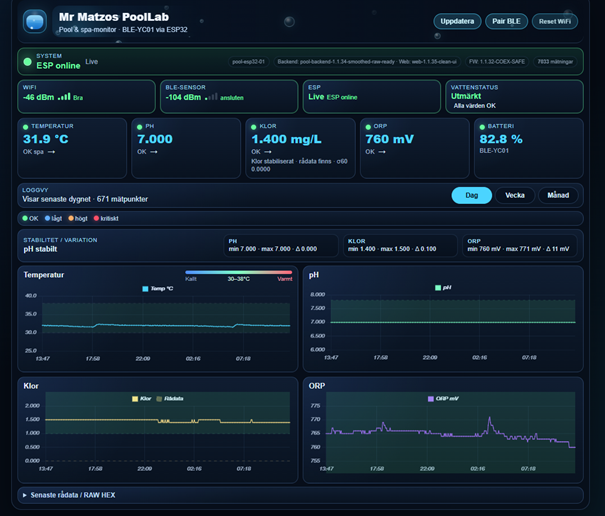
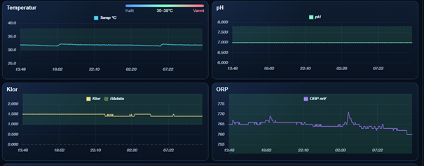

# PoolLab

High-speed BLE pool monitoring platform with ESP32, FastAPI, WebSocket dashboard and OTA support.



---

# Features

- ESP32 BLE-YC01 gateway
- Real-time dashboard
- FastAPI backend
- SQLite storage
- WebSocket live updates
- OTA firmware updates
- Docker deployment
- Nginx reverse proxy
- Sensor filtering and smoothing
- pH / ORP / Chlorine monitoring
- Battery monitoring
- Historical graphs
- Stability analysis
- Raw frame debugging
- BLE diagnostics
- Automatic reconnect logic

---

# System Architecture

```text
BLE-YC01 Sensor
        │
        ▼
ESP32 Pool Gateway
        │ HTTP / JSON
        ▼
FastAPI Backend
        │
 ┌──────┴──────┐
 ▼             ▼
SQLite      WebSocket
 DB            Live UI
                 │
                 ▼
         Browser Dashboard
```

---

# Screenshots

## Dashboard


---

## Stability & Sensor Data



---

## ESP32 OTA Firmware


---

# Hardware

## ESP32

Tested with:

- AZ-Delivery ESP32 Dev Kit V4
- ESP32-WROOM

---

## BLE Pool Sensor

Supported:

- BLE-YC01

---

# Folder Structure

```text
poollab/
 ├── esp32/
 ├── backend/
 ├── web/
 ├── nginx/
 ├── screenshots/
 ├── docs/
 ├── docker-compose.yml
 ├── README.md
 └── LICENSE
```

---

# ESP32 Firmware

Location:

```text
esp32/
```

Main features:

- BLE sensor communication
- OTA updates
- WiFi setup portal
- HTTP API client
- Heartbeat monitoring
- Sensor filtering
- Auto reconnect
- BLE diagnostics

---

# Backend

Location:

```text
backend/
```

Tech stack:

- FastAPI
- Uvicorn
- SQLite3
- WebSocket
- REST API

---

# Web UI

Location:

```text
web/
```

Features:

- Real-time dashboard
- Live charts
- Stability analysis
- Sensor health
- Historical measurements
- Raw/filtered values
- BLE status
- ESP32 heartbeat state

---

# Installation

# 1. Clone repository

```bash
git clone https://github.com/YOUR_USERNAME/poollab.git
cd poollab
```

---

# 2. Start backend

```bash
docker compose up -d
```

---

# 3. Open dashboard

```text
http://YOUR_SERVER:8010
```

---

# ESP32 Setup

# Build firmware

```bash
pio run
```

---

# Upload firmware

```bash
pio run -t upload
```

---

# OTA upload

```bash
pio run -t upload --upload-port 192.168.x.x
```

---

# Web Setup Portal

If WiFi credentials are missing:

ESP32 creates:

```text
SSID: pool-setup
Password: 12345678
```

Open:

```text
http://192.168.4.1
```

---

# API Endpoints

## Measurements

```text
/api/pool/measurements
```

---

## Heartbeat

```text
/api/pool/heartbeat
```

---

## Latest Measurement

```text
/api/pool/latest
```

---

# OTA Support

PoolLab supports OTA firmware updates using ArduinoOTA.

Features:

- OTA maintenance mode
- BLE disconnect handling
- WiFi/BLE coexistence protection
- Automatic reboot handling

---

# Sensor Filtering

PoolLab includes:

- Temperature smoothing
- ORP spike filtering
- pH stabilization
- Chlorine estimation
- Stability calculations

The UI supports both:

- Raw sensor values
- Smoothed values

---

# Docker Deployment

Example:

```bash
docker compose up -d
```

---

# Nginx Reverse Proxy

Included features:

- API reverse proxy
- WebSocket proxy
- Static UI hosting

---

# Development

Recommended tools:

- VS Code
- PlatformIO
- Docker
- Python 3.11+

---

# License

MIT License

---

# Author

Mats Schyllander (c)2026
matsarlemark@gmail.com
Sweden

